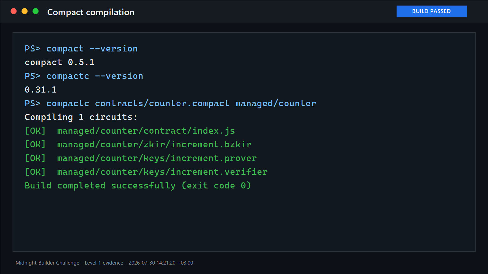
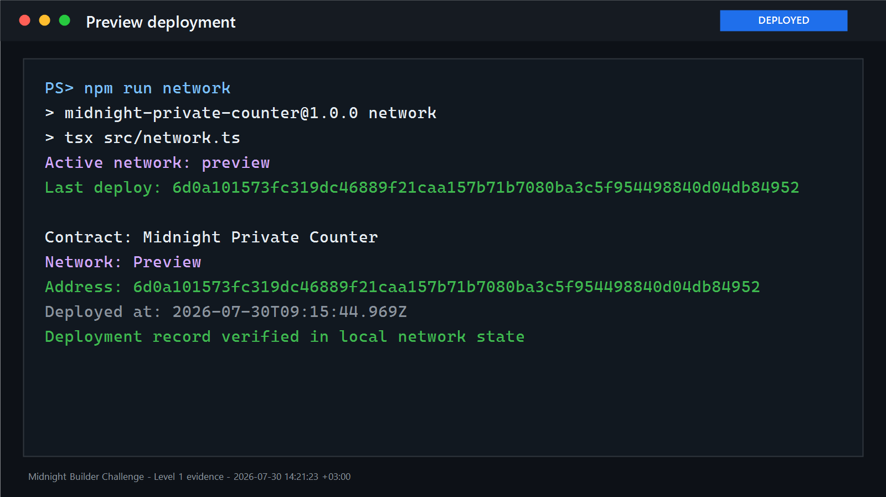
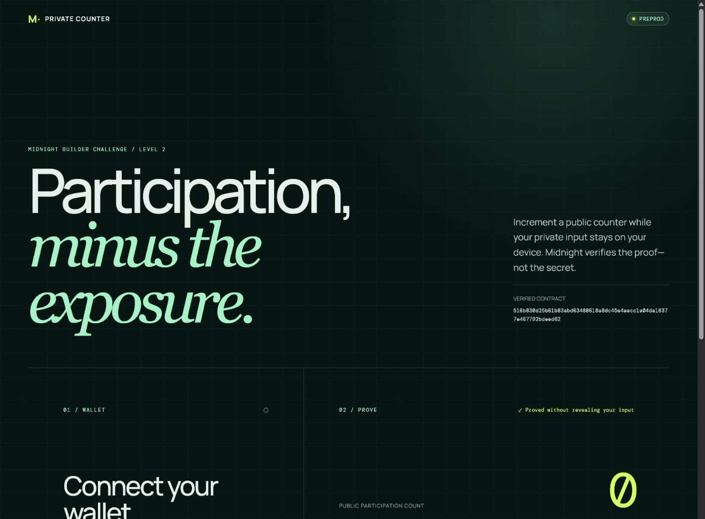

# Midnight Private Counter

> A privacy-preserving participation counter built on Midnight.

## Live Demo

[Open the production dApp](https://midnight-private-counter.ekinonat10.chatgpt.site)

The dApp targets Midnight **Preprod** and requires Lace with Midnight support.
Keep the local proof server running before submitting a circuit call.

## Contract Addresses

| Network | Address | Status |
|---|---|---|
| Preprod | `516b830d25b61b83abd63488618a8dc45e4aecc1a04da18377e467792bdeed62` | Verified |
| Preview | `6d0a101573fc319dc46889f21caa157b71b7080ba3c5f954498840d04db84952` | Level 1 deployment |

The Preprod deployment was completed on July 30, 2026 and independently read
from the official Preprod indexer. Local deployment metadata and wallet
material are intentionally excluded from Git.

## Submission Evidence

| Requirement | Evidence |
|---|---|
| Public repository | [github.com/EkinOnat/midnight-private-counter](https://github.com/EkinOnat/midnight-private-counter) |
| Live frontend | [Midnight Private Counter](https://midnight-private-counter.ekinonat10.chatgpt.site) |
| Demo video | [Wallet connection and successful circuit call](https://youtu.be/uSjGRCvbhCM) |
| Preprod contract | `516b830d25b61b83abd63488618a8dc45e4aecc1a04da18377e467792bdeed62` |
| On-chain verification | Verified through the official Preprod indexer; the address can also be searched on the [Midnight Preprod Explorer](https://preprod.midnightexplorer.com/) |

## What This Does

Connect Lace, review the current public participation count, and submit one
private increment. For every call, the browser generates a fresh random
32-byte nonce. Midnight proves that the contract received a valid private
input, derives a one-way commitment from it, and advances the public counter
by exactly one.

The raw nonce is never published. Observers see the updated count, the latest
commitment, and ordinary transaction metadata—not the private value that
produced the proof.

## Privacy Model

- **PUBLIC (on-chain):** `count`, `lastCommitment`, the contract address, and
  transaction metadata.
- **PRIVATE (local witness):** the fresh 32-byte nonce supplied through
  `privateNonce()`.
- **PROVEN WITHOUT REVEALING:** the circuit received a valid witness, the
  disclosed commitment was derived from it, and the fixed one-step counter
  transition is valid.

The `disclose()` in `contracts/counter.compact` deliberately crosses the
privacy boundary only for the one-way hash commitment. It does not disclose
the witness.

## Privacy Claim

The frontend creates the nonce with `crypto.getRandomValues()` immediately
before the call. It keeps the value in an ephemeral in-memory private-state
provider, never places it in browser storage, logs, URLs, or UI state, removes
it after the call, and overwrites the local byte array in a `finally` block.
Only the public transaction ID, block height, count, and commitment can leave
the circuit boundary.

## Tech Stack

- Midnight Preprod and Preview networks
- Compact developer tools 0.5.1
- Compact compiler 0.31.1 and runtime 0.16.0
- Midnight.js 4.1.1 and DApp Connector API 4.0.1
- Wallet SDK 1.2.0 and proof server 8.1.0
- React 19, TypeScript, Vite, and Vitest
- Node.js 22
- Docker and WSL2 on Windows

The pinned versions follow the
[official Midnight support matrix](https://docs.midnight.network/relnotes/support-matrix).

## Prerequisites

- Git
- Node.js 22 and npm
- Docker Desktop or Docker Engine with Compose
- Compact developer tools 0.5.1 and compiler 0.31.1
- WSL2 with Ubuntu on Windows
- Lace with Midnight support and a funded Preprod wallet
- A local proof server available at `http://127.0.0.1:6300`

See the
[Midnight installation guide](https://docs.midnight.network/getting-started/installation)
and
[browser dApp tutorial](https://docs.midnight.network/tutorials/leaderboard/browser-dapp)
for the supported setup.

## Run Locally

Clone and install:

```bash
git clone https://github.com/EkinOnat/midnight-private-counter.git
cd midnight-private-counter
npm install
```

Compile the Compact contract. On Linux or inside WSL:

```bash
npm run compile
```

From Windows PowerShell, compile through WSL:

```powershell
wsl -- bash -lc "cd /mnt/c/path/to/midnight-private-counter && npm run compile"
```

Start the proof server, run all contract and frontend tests, then start Vite:

```bash
docker compose up -d
docker compose ps
npm test
npm run typecheck
npm run dev
```

Open the local URL printed by Vite, connect Lace on **Preprod**, and select
**Increment counter**. The proof server must remain running while a
call is being proved.

## Deploy the Contract

Select a network and deploy:

```bash
npm run network preprod
npm run deploy -- --network preprod
```

For a new wallet, the script prints the wallet address and waits for test
tNight. Fund that exact address with the appropriate faucet, then leave the
process running while it syncs, registers NIGHT for DUST generation, proves,
and submits the deployment.

Never commit `.midnight-state.json`, `.midnight-wallet-state/`,
`midnight-level-db/`, or any wallet seed.

## Deploy the Frontend

The production contract address and network are public configuration in
`.env.production`; there are no wallet secrets in the frontend.

Exact Vercel CLI commands:

```bash
npm install -g vercel
vercel login
vercel --prod
```

`vercel.json` builds with `npm run build`, publishes `dist`, applies the SPA
fallback, and serves the proving assets with long-lived immutable cache
headers.

## Tests

```bash
npm test
npm run typecheck
npm run build
```

The suite covers:

- contract behavior and sequential public state transitions;
- absence of the raw private nonce from public ledger state;
- successful, rejected, unavailable, and wrong-network wallet connections;
- disconnect cleanup and disabled/loading/success circuit-call UI states;
- static privacy guards against persistence, logging, URL leakage, or retaining
  complete private call results.

## Project Structure

```text
contracts/counter.compact           Compact contract source
managed/counter/                    Generated contract, circuits, and keys
public/                             Web manifest, social card, copied ZK assets
scripts/copy-zk-assets.mjs          Copies generated proving assets for Vite
src/components/                     Wallet and circuit-call UI
src/hooks/useMidnight.ts            Lace discovery and connection lifecycle
src/lib/counter-client.ts           Midnight providers and contract interaction
src/lib/ephemeral-private-state.ts  One-call in-memory witness state
src/deploy.ts                       Preview/Preprod deployment entry point
src/network.ts                      Network selection and local deployment record
src/wallet.ts                       CLI wallet/provider setup
src/witnesses.ts                    Private Compact witness implementation
tests/counter.test.ts               Contract privacy and state tests
tests/frontend/                     Wallet, UI, and privacy-boundary tests
vercel.json                         Production build, routing, and asset headers
.github/workflows/                  Reserved for Level 3 CI/CD
```

## Demo Video

[Watch the Level 2 demo on YouTube](https://youtu.be/uSjGRCvbhCM).

The recording shows an active Lace connection on the live Preprod frontend, a
successful `increment()` circuit call, the local proof/submission loading
state, the public counter advancing from 1 to 2, and the finalized block and
transaction result. It also demonstrates the privacy boundary: the application
proves knowledge of a fresh private nonce without displaying or publishing
that nonce. Explicit disconnect cleanup is implemented in the wallet control
and covered by the frontend test suite.

## Screenshots

### Compact compilation



### Preview deployment



### Level 2 frontend



## Author

[EkinOnat on GitHub](https://github.com/EkinOnat)

## Initial Idea

I want to build a privacy-preserving participation counter for events,
communities, and online campaigns. Participants submit a private nonce that is
never published on-chain. The contract increments a public participation count
and publishes only a one-way commitment derived from the private input. Level 1
established the contract and public/private boundary. Level 2 adds a polished
browser experience, Lace connectivity, ephemeral private state, local proof
generation, and a verified Preprod deployment.
