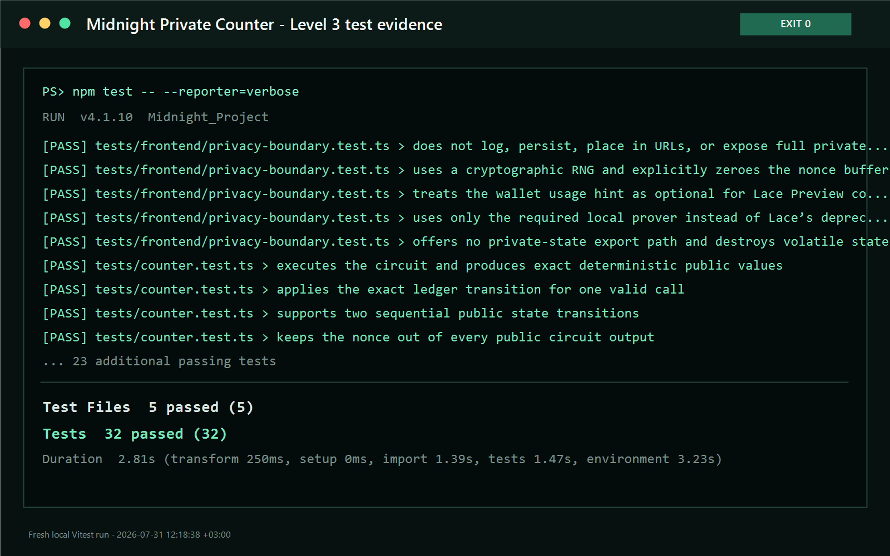

# Midnight Private Counter

[](https://github.com/EkinOnat/midnight-private-counter/actions/workflows/ci.yml)

> A privacy-preserving participation counter built on Midnight.

## Live Demo

[Open the production dApp](https://midnight-private-counter.ekinonat10.chatgpt.site)

The dApp targets Midnight **Preview** and requires Lace with Midnight support.
Keep the local proof server running at `http://127.0.0.1:6300` before submitting
a circuit call.

## Contract Address

| Network | Address |
|---|---|
| Preview (active) | `6d0a101573fc319dc46889f21caa157b71b7080ba3c5f954498840d04db84952` |
| Preprod (July submission; historical) | `516b830d25b61b83abd63488618a8dc45e4aecc1a04da18377e467792bdeed62` |

The Preview contract was deployed on July 30, 2026 and reverified against the
public Preview indexer on August 4, 2026 as part of the Rise In migration.

## What This Does

Connect Lace, read the public participation count, and submit an increment using
a private input. For each call, the browser creates a fresh random 32-byte
nonce. The Compact circuit derives a public one-way commitment from that nonce
and advances the public counter by exactly one.

The circuit itself returns no value. After the transaction finalizes, the dApp
shows the public transaction ID and block height and reads the updated public
count from the Preview indexer.

## Privacy Model

- **PUBLIC:** `count`, `lastCommitment`, the contract address, the fact that an
  increment occurred, and ordinary protocol transaction metadata.
- **PRIVATE:** the raw 32-byte nonce used as the `privateNonce()` witness. It is
  handled only in the caller's browser and local proving flow and is not written
  to the Compact ledger.
- **PROVED without revealing:** a valid circuit execution received a 32-byte
  witness, derived the disclosed commitment from it, and performed the fixed
  one-step counter transition.

The assignment to public `lastCommitment` is the visibility boundary.
`disclose()` acknowledges to the Compact compiler that the derived hash—not the
raw witness—is intentionally allowed to cross it.

## Privacy Claim

An on-chain observer can see the counter's history, each published
`lastCommitment`, and transaction data needed by the protocol. The observer can
therefore see that an increment happened and how the public count changed. The
raw nonce is absent from the public ledger and from the circuit's empty return
value, so it is not directly available to that observer.

The commitment is public and is not encryption. A predictable or low-entropy
nonce could be guessed and checked against its commitment; the application
mitigates that risk by generating a fresh 256-bit value with
`crypto.getRandomValues()` for every call. Privacy does not hide the existence
of participation, the public count, the commitment, or transaction metadata.

In the browser implementation, the nonce is placed in a one-call in-memory
private-state provider, the proof endpoint is restricted to loopback, and the
provider entry is removed and the local byte array is overwritten in a
`finally` block. The app does not intentionally put the nonce in UI state,
logs, URLs, or browser storage. This is an application boundary, not protection
against a compromised browser, wallet, device, or local proof server.

## Tech Stack

- Midnight Preview
- Compact devtools 0.5.1, Compact compiler 0.31.1, and Compact runtime 0.16.0
- Midnight.js 4.1.1 and DApp Connector API 4.0.1
- Wallet SDK 1.2.0 and proof server 8.1.0
- React 19, TypeScript, Vite, and Vitest
- Node.js 22
- Docker; WSL2 is recommended for Windows development

The pinned Midnight versions follow the
[official support matrix](https://docs.midnight.network/relnotes/support-matrix).

## Prerequisites

- Git
- Node.js 22 and npm
- Docker Desktop or Docker Engine with Compose
- Compact devtools 0.5.1 with Compact compiler 0.31.1
- Lace with Midnight support, set to Preview, with a funded Preview wallet
- A Chromium-based browser
- WSL2 with Ubuntu when developing on Windows

See the
[Midnight installation guide](https://docs.midnight.network/getting-started/installation)
and
[browser dApp tutorial](https://docs.midnight.network/tutorials/leaderboard/browser-dapp)
for the supported environment.

## Setup & Run Locally

Midnight development is supported on Linux and macOS. On Windows, install the
Compact toolchain inside the default WSL2 distribution. The repository's
compile wrapper invokes that WSL toolchain automatically, preventing native
PowerShell from resolving `compact` to the unrelated Windows filesystem
utility.

If PowerShell blocks the `npm.ps1` launcher under its execution policy, use
the equivalent `npm.cmd` form for every npm command (for example,
`npm.cmd run compile`).

1. Clone the repository and enter it:

   ```bash
   git clone https://github.com/EkinOnat/midnight-private-counter.git
   cd midnight-private-counter
   ```

2. Install the pinned Compact devtools and compiler. Windows users should run
   this step inside WSL2:

   ```bash
   curl --proto '=https' --tlsv1.2 -LsSf \
     https://github.com/midnightntwrk/compact/releases/download/compact-v0.5.1/compact-installer.sh \
     | sh
   export PATH="$HOME/.local/bin:$PATH"
   compact update 0.31.1
   compact --version
   compact compile +0.31.1 --version
   ```

3. Install the locked dependencies, configure the public Preview values, and
   compile the contract. On Windows, these commands can run from PowerShell;
   `npm run compile` delegates only the compiler process to WSL2:

   ```bash
   npm ci
   cp .env.example .env.local
   npm run compile
   ```

4. Start and verify the local proof server:

   ```bash
   docker compose up -d
   docker compose ps
   ```

5. Start the frontend:

   ```bash
   npm run dev
   ```

Open the local URL printed by Vite, connect Lace on **Preview**, and select
**Increment counter**. Keep the proof server running while the call is proved
and submitted. The values in `.env.local` are public configuration; never add
wallet seeds, private keys, or witness data.

## Run Tests

Run the complete contract and frontend suite:

```bash
npm test
```

Run the remaining local quality checks:

```bash
npm run typecheck
npm run build
```

The suite covers contract circuit behavior, sequential public state
transitions, the private witness boundary, wallet connection states,
disconnect cleanup, pending/success UI states, and static guards against
persistence or display of private call data.

## CI/CD

`.github/workflows/ci.yml` runs on every pull request and every push to `main`.
It uses Node.js 22, restores npm's download cache, installs dependencies with
`npm ci`, installs Compact devtools 0.5.1 and compiler 0.31.1, recompiles the
contract, rejects stale generated artifacts, runs the complete test suite, and
performs the production build. `npm run build` includes TypeScript checking.
The workflow does not deploy the contract or frontend.

The live badge above can turn green only after this workflow is pushed to
GitHub and completes successfully.

## Product Proposal

See [PROPOSAL.md](PROPOSAL.md).

## Submission Evidence

| Requirement | Evidence |
|---|---|
| Public repository | [github.com/EkinOnat/midnight-private-counter](https://github.com/EkinOnat/midnight-private-counter) |
| Live frontend | [Midnight Private Counter](https://midnight-private-counter.ekinonat10.chatgpt.site) |
| Demo video | [Level 3 wallet connection and private circuit call](https://youtu.be/N2mgrGWao4Y) |
| Preview contract (active) | `6d0a101573fc319dc46889f21caa157b71b7080ba3c5f954498840d04db84952` |
| Preview faucet | [faucet.preview.midnight.network](https://faucet.preview.midnight.network/) |
| July-approved Preprod contract (historical) | `516b830d25b61b83abd63488618a8dc45e4aecc1a04da18377e467792bdeed62` |

The Preview and Preprod deployments were completed on July 30, 2026. The
Preview contract was confirmed live through the Preview indexer on August 4,
2026 and is now the dApp's active deployment. The Preprod address remains here
only as evidence for the approved July submission. Local deployment metadata
and wallet material are intentionally excluded from Git.

## Deploy the Contract

Select Preview and deploy:

```bash
npm run network preview
npm run deploy -- --network preview
```

For a new wallet, the script prints the wallet address and waits for test
tNight from the [Preview faucet](https://faucet.preview.midnight.network/).
Fund that exact address, then leave the process running while it syncs,
registers NIGHT for DUST generation, proves, and submits the deployment.

Never commit `.midnight-state.json`, `.midnight-wallet-state/`,
`midnight-level-db/`, or any wallet seed.

## Deploy the Frontend

The production contract address and network are public configuration in
`.env.production`; there are no wallet secrets in the frontend bundle.

The included `vercel.json` supports this Vercel CLI flow:

```bash
npm install -g vercel
vercel login
vercel --prod
```

It builds with `npm run build`, publishes `dist`, applies the SPA fallback, and
serves the proving assets with long-lived immutable cache headers.

## Project Structure

```text
contracts/counter.compact           Compact contract source
managed/counter/                    Generated contract, circuits, and keys
public/                             Web manifest, social card, copied ZK assets
scripts/compile-contract.mjs        Pins Compact 0.31.1 and uses WSL on Windows
scripts/copy-zk-assets.mjs          Copies generated proving assets for Vite
src/components/                     Wallet and circuit-call UI
src/hooks/useMidnight.ts            Lace discovery and connection lifecycle
src/lib/counter-client.ts           Midnight providers and contract interaction
src/lib/ephemeral-private-state.ts  One-call in-memory witness state
src/deploy.ts                       Preview deployment entry point
src/network.ts                      Network selection and local deployment record
src/wallet.ts                       CLI wallet/provider setup
src/witnesses.ts                    Private Compact witness implementation
tests/counter.test.ts               Contract privacy and state tests
tests/frontend/                     Wallet, UI, and privacy-boundary tests
.github/workflows/ci.yml            Compile, test, and production-build workflow
PROPOSAL.md                         Level 3 product proposal template
vercel.json                         Production build, routing, and asset headers
```

## Demo Video

[Watch the Level 3 demo on YouTube](https://youtu.be/N2mgrGWao4Y).

The July Level 3 recording shows an active Lace connection on the then-live Preprod
frontend, a successful `increment()` circuit call, the local proof/submission
progress, the public counter advancing by exactly one, and the finalized block
and transaction result. It also demonstrates the privacy boundary: the
application proves knowledge of a fresh private nonce without displaying or
publishing that nonce. Explicit disconnect cleanup is implemented in the
wallet control and covered by the frontend test suite.

## Screenshots

### Compact compilation


### Preview deployment


### Level 2 frontend


### Level 3 test suite



## Author

[EkinOnat on GitHub](https://github.com/EkinOnat)

## Initial Idea

I want to build a privacy-preserving participation counter for events,
communities, and online campaigns. Participants submit a private nonce that is
never published on-chain. The contract increments a public participation count
and publishes only a one-way commitment derived from the private input. Level 1
established the contract and public/private boundary. Level 2 added a polished
browser experience, Lace connectivity, ephemeral private state, local proof
generation, and a verified deployment. The project now targets Preview while
retaining the approved July Preprod address as historical evidence. Level 3
adds reproducible CI and the product-proposal framework.
